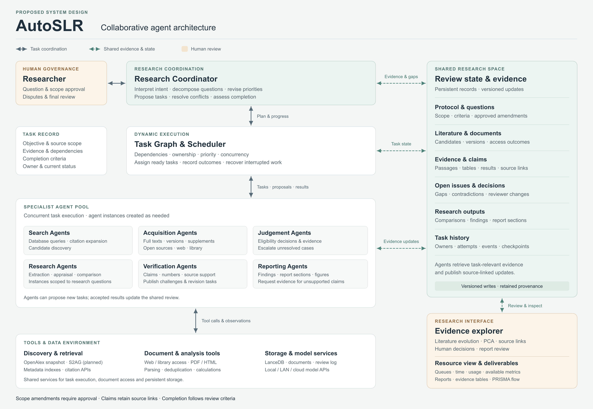

# Architecture and Evaluation Plan

Last Update: 30 September 2026. 
This document describes the proposed system and its validation.

## Workflow

LangGraph/Hermes harness will coordinate agents through shared review state and checkpoints. Agents will choose evidence-seeking actions through explicit tools and return structured records. Validated transitions will control progression, revision and human review.

* Figure generated by ChatGPT

| Review function | Responsibility | Output or review point |
|---|---|---|
| Protocol | The Coordinator and researcher define the question, scope, eligibility criteria and extraction requirements. | Approved, versioned review protocol. |
| Discovery | Search Agents query databases and follow references and citations. | Candidate records with search provenance. |
| Acquisition | Acquisition Agents locate full texts, supplements and suitable document versions. | Validated documents or recorded retrieval gaps. |
| Eligibility | Judgement Agents assess candidates against the approved criteria. | Evidence-supported inclusion or exclusion decisions; uncertain cases for human review. |
| Extraction | Research Agents extract methods, experimental conditions and findings. | Structured evidence with source locations and missing fields recorded. |
| Appraisal | Research Agents assess study quality and the strength of reported evidence. | Quality judgements with supporting reasons. |
| Verification | Verification Agents check claims, numerical values and their supporting sources. | Checked evidence and specific tasks for resolving discrepancies. |
| Synthesis | Research Agents compare findings; Reporting Agents organise the results into a report. | Evidence-linked comparisons, conclusions and a draft for human review. |

Reference and citation searches, and new candidates found during acquisition, return to discovery. Retrieval gaps remain in a pending queue. Human corrections are recorded and passed to subsequent stages.

## Sources, Tools and Storage

The OpenAlex snapshot will provide the local discovery base. Semantic Scholar S2AG is the planned supplementary index for broader coverage and citation links. The KV-cache feasibility test used arXiv as its actual supplementary search source.

Acquisition will progress through cached documents, open APIs and repositories, agent-directed DOI/title/author searches, and authorised university-library assistance or manual import. Retrieved files will be checked for identity, publication date, version and readability.

Deterministic tools will execute searches, downloads, parsing, deduplication and flow-count calculations. Agents will select actions and assess evidence. Retrieval attempts and revision reasons will be recorded, with configurable retry limits and checkpoint recovery.

LanceDB will support metadata and embedding retrieval. Documents and review records will be stored separately, linked by report, study and version identifiers. Each review will retain queries, source lineage, document locations, decisions, reasons, extracted evidence, verification results and human changes. Claims in the report will link back to source passages or tables.

## Runtime and Interface

The model adapter will support local, LAN services. Paths and storage locations will be configurable across macOS, Windows and Linux servers. Context size, response length and concurrency will be checked against the configured service's capabilities.

The interface will offer simple defaults and advanced controls for models, context, response limits, concurrency, timeouts and retries. A resource panel will show queue state, latency and cumulative usage. Token and cache counts will use provider-reported data where available; cost estimates will use recorded usage and configured prices. Hardware measurements require local or remote instrumentation.

Existing literature-evolution, PCA and clustering views will support evidence inspection and method comparison. A planned 10,000-record visualization regression check will test large-corpus exploration. Users will be able to inspect papers, follow evidence links, correct decisions and resume reviews.

## Evaluation

The main experiment will compare a fixed workflow with the agent workflow under comparable model, data and tool conditions. Separate ablations will assess adaptive full-text search, verification and revision. Differences in resource use will be recorded.

| Outcome | Planned measure |
|---|---|
| Screening | Precision, recall and F1 against reviewed labels |
| Retrieval | Acquisition, readability and version eligibility |
| Resources | Elapsed time, model usage, cost and human effort |
| Reliability | Completion, failures, recovery and repeat-run variation |

End-to-End Case Studies will use published SLRs as case studies. One case will support development, and a separate held-out case will support final evaluation. Each case will cover the complete review process, from the research question and protocol to the final report. System outputs will be compared with human-checked reference evidence to assess study selection, extraction and synthesis. The analysis will also examine resource use, human intervention and unresolved evidence gaps.

See the [weekly plan](README.md) and [KV-cache feasibility test](02_KV_Cache_Case_Study.md).
